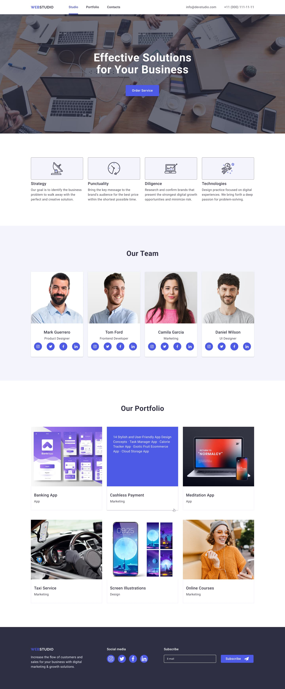
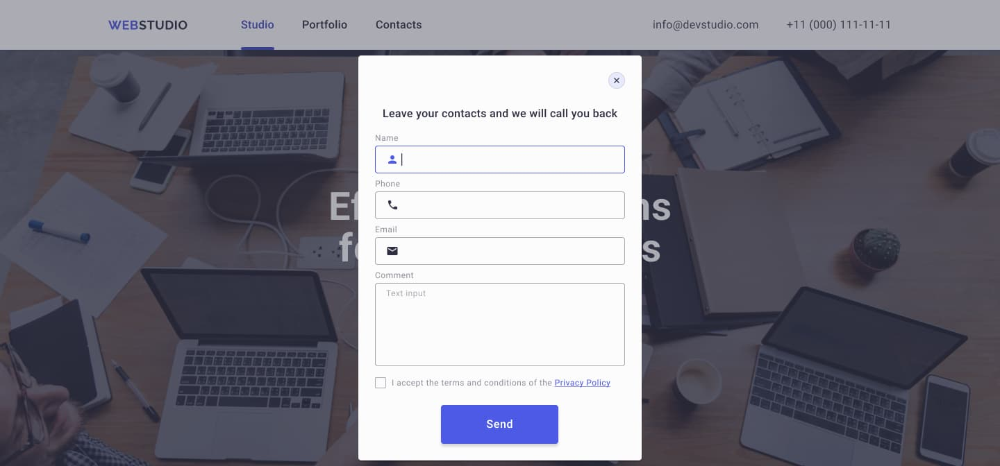

# Project "WebStudio"

---

**Web Studio website development from the [GoIT](https://goit.global/ua/) training cycle. The project was developed as part of the layout training program, demonstrating mastery of basic development tools such as `HTML`, `CSS`, and `JavaScript`.**

WebStudio is a demo website created for a modern web design studio. The project showcases key aspects of professional web development, including responsive design, appealing visuals, and user-friendliness.

## Project Goals

**The purpose of this project is to demonstrate:**

- Expertise in creating an attractive and functional interface.
- A responsive approach to ensure correct display on various devices.
- Knowledge of core web design and development principles, including the use of HTML, CSS, and JavaScript.

## Website Features

1. **Modern Design.**
   The website design adheres to a minimalist style, drawing attention to the main elements. It uses harmonious color schemes, user-friendly typography, and an efficient layout.

2. **Responsiveness.**
   The site is fully adapted for viewing on different devices, from mobile phones to large monitors. This is achieved through the use of CSS Flexbox and Media Queries technologies.

3. **User-Friendly Structure.**

   - Intuitive navigation makes it easy to find the necessary information.
   - Website sections are clearly divided: home page, services, portfolio, team, testimonials, and contacts.

4. **Interactive Elements.**
   Animations, hover effects, and smooth scrolling add dynamics and positively impact user interaction.

5. **Fast Loading**
   Optimized code and images ensure high performance and quick load times.

## Technologies Used in the Project.

- **HTML5** for creating the semantic structure of pages.
- **CSS3** for styling, including Flexbox and Grid Layout for element positioning.
- **JavaScript** for interactivity, animations, and functionality.
- **GitHub Pages** for hosting the website online.

## Development

It was carried out step by step in accordance with homework, theoretical and practical training. The step-by-step development and the goals that stood for each task can be found below.

1. [Learning GoIT homework on HTML+CSS - #1.](https://github.com/andriiyakymiv/goit-markup-hw-01)
   I understood how a web page works. I learned to use basic tags and their attributes. I got acquainted with the principles of semantic markup and applied them in practice. I learned what structural markup is and how it relates to the structure of an HTML document. I determined the algorithm for creating a web page. I understood image formats and learned how to transfer them from a layout to a project.
2. [Learning GoIT homework on HTML+CSS - #2.](https://github.com/andriiyakymiv/goit-markup-hw-02)
   I learned what CSS is, what are the ways to add styles, and how to decide which one to choose. I learned how to customize the color of elements. I studied the types of selectors and the rules for their application and combination. I learned how to customize fonts and format text.
3. [Learning GoIT homework on HTML+CSS - #3.](https://github.com/andriiyakymiv/goit-markup-hw-03)
   Block model. Element geometry. Interaction of margins and padding of different elements. Basic concepts of Flexbox technology. Pseudoclasses.
4. [Learning GoIT homework on HTML+CSS - #4.](https://github.com/andriiyakymiv/goit-markup-hw-04)
   Setting up backgrounds, gradients, and shadows. CSS property transition scripts. Using CSS animations. Embedded SVG and SVG sprites.
5. [Learning GoIT homework on HTML+CSS - #5.](https://github.com/andriiyakymiv/goit-markup-hw-05)
   Form. Form markup. Styling forms. The markup of the newsletter subscription form and all its elements in the footer. The markup of the application form.
6. [Learning GoIT homework on HTML+CSS - #6.](https://github.com/andriiyakymiv/goit-markup-hw-06)
   Adaptive layout for the web studio's website and layout in accordance with adaptability requirements were performed.

## Practical Value

This project was developed as part of the GoIT training program and showcases proficiency with fundamental web development tools. It can serve as a foundation for building real websites and as a portfolio piece to demonstrate the authors skills.

## Screenshot project

---

